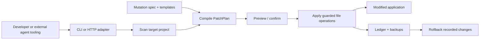

# Injext

> A TypeScript mutation engine that turns repeatable software changes into structured, inspectable capabilities for developers and AI coding agents.

**The premise:** coding agents should not have to reason through every known software operation from scratch.

AI coding agents are good at reasoning through unfamiliar work. They are also repeatedly asked to reconstruct familiar changes—add authentication, wire a route, introduce billing, update a schema—from first principles.

Injext explores a different boundary: define known classes of software change once as inspectable mutation specifications, then compile and apply those definitions to an existing project without asking a model to regenerate the operation token by token.

## ⚠️ Project status — experimental

**Injext is an architecture prototype and foundation for further development, not a production-ready system.** It is being open-sourced for developers to inspect, experiment with, extend, and build upon.

**Do not assume generated code is secure or production-safe by default.** Included mutations are reference implementations and require application-specific security, validation, testing, and operational review before production use.

**AI should not only make existing workflows faster. It should change what we consider a practical system to build.**

## The idea

A coding agent can produce a feature directly, but the result depends on model context, prompting, and a fresh round of reasoning. For changes that recur across projects, another option is to promote the procedure itself into a reusable capability.

In Injext, a mutation is a small package of:

- a declarative `spec.json` describing files, injections, dependencies, environment variables, and template-specific behavior;
- Handlebars templates containing the implementation to emit;
- engine rules that adapt those assets to a detected project shape;
- version metadata for the definition.

The source-controlled definition makes the intended procedure readable and reusable across supported project layouts. After application, the engine writes a local ledger entry recording the affected files and backup location. The current engine can preview a plan, apply it with backups, and attempt a later rollback of the recorded file changes.

## Why this is an AI problem

Applying AI to existing product categories can be valuable. This project investigates a different layer: the systems and abstractions that expand what AI-assisted developers and coding agents can do.

The goal is not to remove generative AI from software development. It is to give agents higher-level primitives so they do not need to reconstruct every known operation token by token:

- **Probabilistic reasoning** can interpret intent, choose a capability, supply parameters, resolve ambiguity, and review the result.
- **Deterministic machinery** can render a predefined operation, enforce path boundaries, apply known file changes, and record what happened.

The current prototype does not embed a model or an agent runtime. It implements the deterministic side of that interface through a CLI and an optional HTTP wrapper that external tooling could call.

## How it works



1. **Scan** — `src/engine/scan.ts` reads `package.json`, locates a conventional server entry point, and profiles an Express or Replit-style project.
2. **Compile** — `src/engine/planner.ts` selects template-specific assets, renders Handlebars, resolves output paths, and produces typed patch operations.
3. **Preview** — the CLI displays files, dependencies, and environment variables that the plan intends to change; `--dry-run` stops here.
4. **Apply** — `src/engine/patcher.ts` creates files, performs guarded string/pattern injections, updates package metadata and `.env.example`, and backs up existing files before modifying them.
5. **Record** — `src/engine/ledger.ts` stores project-relative paths and rollback metadata under `.injext/`.
6. **Recover** — `src/engine/rollback.ts` validates ledger paths, deletes files created by the mutation, and restores modified files when their backups are available.

See [Architecture](docs/ARCHITECTURE.md) for operation types, execution boundaries, rollback semantics, and extension points.

## What exists today

The repository contains a working CLI, an optional hosted execution adapter, and 11 built-in mutation definitions.

Selected examples:

- **Authentication** emits JWT middleware and routes, using an in-memory store for plain Express or Drizzle schema integration for the recognized Replit full-stack shape.
- **Admin** adds role-aware middleware, user-management routes, and a Replit-oriented dashboard, with `ADMIN_SECRET` as a bootstrap/fallback credential.
- **Billing** adds Stripe checkout, portal, subscription, and bounded raw-webhook handling; its router is mounted before global JSON parsing so signature verification can use the original bytes.
- **API keys** generates random credentials and stores SHA-256 hashes rather than raw keys.
- **Feature flags** includes deterministic percentage bucketing based on SHA-256.
- **Observability** adds request logging plus health, metrics, and version endpoints.

The full library is `auth`, `route <name>`, `admin`, `analytics`, `api-keys`, `background-jobs`, `billing`, `feature-flags`, `file-storage`, `notifications`, and `observability`.

Several plain-Express templates intentionally use in-memory persistence, and the generic route mutation contains explicit database TODOs. These are examples of the transformation model, not finished application subsystems.

## Design principles

- **Structured over ad hoc.** Known transformations live in explicit specs and templates instead of being reconstructed for every invocation.
- **Reason where ambiguity exists; execute predictably where it does not.** Injext focuses on the boundary where an agent can select an operation and deterministic code can carry it out.
- **Preview before write.** Plans are visible before confirmation, and dry runs avoid filesystem changes.
- **Adapt to known shapes.** Template conditions let one mutation target the conventions of plain Express and a recognized Replit full-stack layout.
- **Recover local changes.** Existing files are backed up, partial patch failures trigger restoration, and successful local runs are written to a rollback ledger. This is a recovery mechanism, not a substitute for version control.
- **Extend at the capability layer.** A new built-in mutation is primarily a spec plus templates; the engine does not need a new command for every capability.
- **Treat code execution as a security boundary.** The hosted adapter validates archive paths and sizes, requires a bearer token, limits execution time, and returns only recorded changed files. It does not provide production-grade sandboxing by itself.

## Try the prototype

Requirements:

- Node.js 20 or newer
- npm
- A conventional Express project that can consume TypeScript output, or the supported Replit-style TypeScript full-stack shape

The project is named Injext; the current npm package and CLI executable remain `stackmod`.

Build and link the CLI from source:

```bash
git clone https://github.com/greenman1/new-without.git
cd new-without
npm ci
npm run build
npm link
```

Use it from a disposable branch of a target project:

```bash
cd /path/to/your-app

stackmod scan
stackmod add auth --dry-run
stackmod add auth
stackmod add route users
stackmod history
stackmod rollback <rollback-id>
```

After applying a mutation, inspect the generated code, run `npm install` for added dependencies, configure the new environment variables, and execute the target project's own validation suite.

## Writing a mutation

Built-in capabilities live under `src/mutations/add-<name>/`:

1. `spec.json` declares files, conditional injections, dependencies, environment variables, and entry-point wiring.
2. `templates/` contains the source fragments or complete files rendered against the detected project profile.
3. The shared planner compiles the definition into the same `PatchPlan` used by every other mutation.

The engine currently discovers mutations from its bundled directory; there is no external registry or package-discovery protocol yet. See [Architecture: Extension model](docs/ARCHITECTURE.md#extension-model) for the current contract.

## Optional hosted execution

The CLI is the core system and runs locally. `src/server/server.ts` adds a Fastify adapter for remote execution:

1. a client sends a tar.gz project to `POST /mutate?mutation=<name>`;
2. the server authenticates the request and extracts accepted entries into a temporary directory;
3. it invokes the compiled CLI in a child process;
4. it returns a tar.gz containing the files recorded as created or modified.

```bash
npm run build
export STACKMOD_API_TOKEN="$(openssl rand -hex 32)"
npm start
```

The adapter includes constant-time bearer-token comparison, mutation-name validation, archive path/type filtering, upload and extraction limits, decompression-ratio protection, a child-process timeout, and temporary-directory cleanup.

Those controls are useful defenses, but temporary directories and subprocesses are not a security sandbox. A real deployment still needs isolated workers or containers, TLS, network controls, rate limiting, resource quotas, monitoring, and token rotation. Hosted responses omit `.injext` backups and ledger state; apply returned files under version control.

See [.env.example](.env.example) for the available limits and [Security](SECURITY.md) for the deployment warning.

## Current limitations

- **Narrow compatibility surface.** Detection currently recognizes Express and one conventional Replit full-stack layout. Entry points and injection anchors come from a fixed set of patterns.
- **TypeScript-oriented output.** The scanner can identify JavaScript projects, but the bundled mutations emit `.ts` and `.tsx` files.
- **Text-based transformations.** Imports, routes, and schema fragments are inserted with string and regular-expression anchors rather than an AST. Unusual formatting or structure can cause a plan to fail or require manual edits.
- **Starter implementations.** Several mutations use in-memory persistence or application-specific assumptions. Generated auth, admin, API-key, file, billing, and notification code needs target-specific validation and security review.
- **Limited compatibility testing.** Integration tests cover the core engine, rollback boundaries, selected generated-code security properties, and the hosted happy path. They do not compile and exercise every mutation against a broad matrix of real applications.
- **Recovery is scoped.** Local backups cover files known to the patch plan. Rollback depends on retained `.injext` state and does not replace Git, database migrations, or external-system rollback.
- **Hosted isolation is incomplete.** The HTTP adapter filters input and constrains execution, but it runs mutation code with the service process's filesystem permissions and has no built-in rate limiter or policy engine.
- **No native agent protocol.** An agent can invoke the CLI or HTTP endpoint through external orchestration, but capability discovery, typed tool schemas, composition, and conflict resolution are not implemented.
- **No mutation registry.** Definitions are bundled with the package; provenance, signing, compatibility resolution, and third-party distribution remain open design work.

## Roadmap

The next steps fall into four platform layers:

1. **Production hardening** — validate mutation schemas, add explicit preconditions and postconditions, compile/test generated output, broaden compatibility fixtures, and execute hosted jobs in isolated workers with stronger observability and policy controls.
2. **Mutation ecosystem** — define compatibility metadata and version policy, improve authoring/test tooling, and explore a registry with provenance and trust signals.
3. **Agent-oriented composition** — expose discoverable capability schemas, let agents select and parameterize mutations, and plan dependencies or conflicts across multiple operations.
4. **Platform controls** — add remote-job orchestration, team policy, approvals, audit trails, and governance around which transformations may run in which environments.

These are directions suggested by the prototype, not shipped capabilities.

## The larger idea

AI should not only make existing workflows faster. It should change what we consider a practical system to build.

There is substantial value in applying AI to established applications and workflows. My interest with Injext is further upstream: what new primitives, interfaces, and infrastructure become useful when AI agents participate directly in software creation?

One possible leverage point is the capability boundary. If a recurring engineering operation can be represented, inspected, tested, and invoked as a unit, then many developers and agents can build on that capability instead of independently rediscovering the procedure. Injext is a concrete experiment in that direction.

Read [Vision](docs/VISION.md) for the hypothesis, the intended AI/deterministic boundary, and the architectural questions that remain open.

## Development and security

```bash
npm test        # build and run integration tests
npm run check   # tests, production dependency audit, and package dry run
```

CI runs the test and release checks on Node.js 20 and 22 and scans the full Git history with Gitleaks. Dependabot tracks npm and GitHub Actions updates.

- [Architecture](docs/ARCHITECTURE.md)
- [Vision](docs/VISION.md)
- [Contributing](CONTRIBUTING.md)
- [Security policy](SECURITY.md)
- [Code of Conduct](CODE_OF_CONDUCT.md)
- [Changelog](CHANGELOG.md)

## About the builder

I'm [greenman1](https://github.com/greenman1), a product-minded builder interested in places where AI changes the mechanics of software—not only where an LLM can be added to an existing application.

I am particularly interested in AI platforms, developer tooling, agent systems, new human/AI interfaces, and product opportunities that emerge when AI becomes part of the underlying mechanics of software rather than simply another feature added to it.

I'm interested in AI leadership opportunities where product strategy, technical judgment, and hands-on experimentation intersect—particularly around AI platforms, developer tooling, agent systems, and new product categories enabled by AI.

## License

[MIT](LICENSE)
