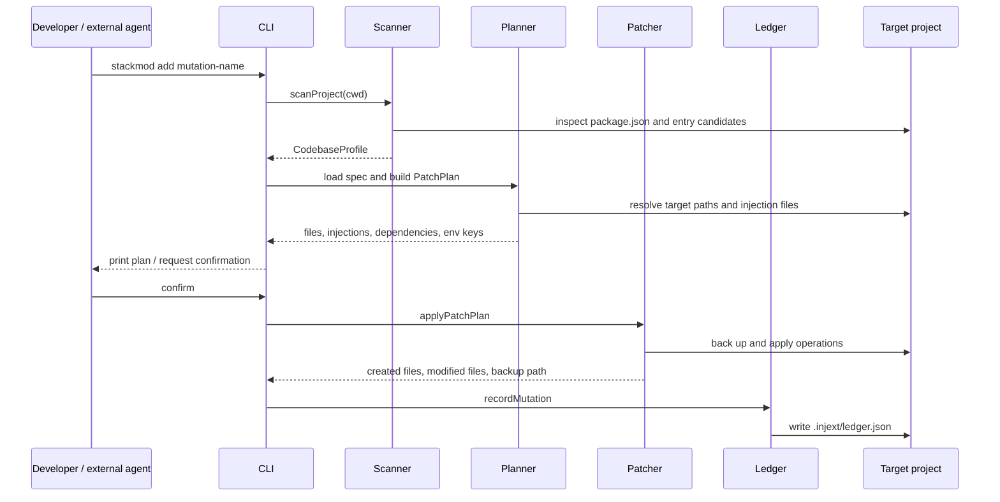
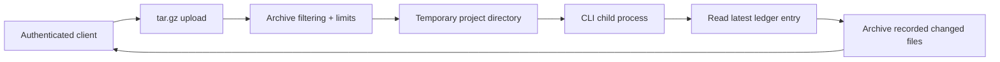

# Injext architecture

This document describes the implementation that exists today. Injext is an experimental mutation engine for conventional Express and Replit-style TypeScript projects; it is not a general-purpose codemod framework or a production sandbox.

## System boundary

The central abstraction is a **mutation**: a versioned specification plus templates that describe a known class of source-code change.

The engine does not ask a model to generate code. It:

1. profiles a target project;
2. renders a selected mutation against that profile;
3. compiles the result into a `PatchPlan`;
4. applies a fixed set of filesystem operations;
5. records enough local state to attempt rollback.

That makes Injext suitable as a deterministic capability beneath a human workflow or external agent orchestrator. Choosing the right mutation, deciding whether its assumptions fit, and reviewing the result remain outside the engine.

## Components

- `src/cli.ts` — Commander-based interface for `scan`, `add`, `history`, and `rollback`.
- `src/engine/scan.ts` — project detection and `CodebaseProfile` construction.
- `src/engine/planner.ts` — mutation loading, Handlebars rendering, path resolution, and `PatchPlan` construction.
- `src/engine/patcher.ts` — guarded file creation/injection, metadata updates, backups, and partial-failure restoration.
- `src/engine/ledger.ts` — portable local mutation records under `.injext/`.
- `src/engine/rollback.ts` — path-validated deletion and restoration of recorded files.
- `src/mutations/` — bundled mutation specifications and templates.
- `src/server/server.ts` — optional Fastify adapter for archive-in / changed-files-out execution.

## Local execution flow



### 1. Project profiling

`scanProject` requires a `package.json` and searches a fixed, ordered set of server entry candidates such as `server/index.ts`, `src/server.ts`, and `index.js`.

The profile records:

- whether `express` is present in runtime, development, or peer dependencies;
- whether the project appears to use TypeScript;
- the selected server entry file;
- server and shared directories;
- a conventional database module path;
- either the `express` or `replit-fullstack` template shape.

The Replit shape is recognized when `server/routes.ts` exists and contains `registerRoutes`. This is convention detection, not semantic analysis.

### 2. Mutation definition

Each bundled mutation lives in `src/mutations/add-<name>/` and contains:

- `spec.json` with an id, version, description, output files, optional file injections, dependencies, environment keys, and entry-point wiring;
- a `templates/` directory with complete files or fragments rendered by Handlebars;
- optional `when` conditions selecting an `express` or `replit-fullstack` variant.

A minimal mutation resembles:

```json
{
  "id": "add-route",
  "version": "0.1.0",
  "files": [
    {
      "path": "src/routes/{{routeName}}.ts",
      "template": "route.ts.hbs"
    }
  ],
  "dependencies": [],
  "env": [],
  "entry_injection": {
    "type": "express_router",
    "mount": "/{{routeName}}",
    "import": "./routes/{{routeName}}"
  }
}
```

The current loader reads JSON into the TypeScript interface directly. It does not yet perform runtime schema validation or compatibility negotiation.

### 3. Plan compilation

The planner combines profile fields and command parameters into the Handlebars context. It produces typed operations rather than writing files directly.

The current operation vocabulary is:

- `create_file` — emit a rendered file; fail if the target already exists;
- `modify_file` — inject an Express or Replit route import and mount;
- `append_file` — append a rendered fragment when its guard is absent;
- `insert_before_pattern` — insert a rendered fragment at a regular-expression anchor;
- `add_dependency` — add a versioned package to `dependencies` when absent;
- `add_env` — append an environment-variable stub to `.env.example` when absent.

Mutation names and CLI parameters use a restricted lowercase name format. Template and output paths are resolved against their expected roots and rejected if they escape those roots.

The CLI plan is a summary of intended files, dependencies, and environment keys. It is not currently a line-by-line source diff.

### 4. Patch application

Before modifying an existing file, the patcher copies it into `.injext/backups/<rollback-id>/` and only backs up each path once.

During one `applyPatchPlan` call:

- newly created files are tracked;
- modified files and metadata files are tracked;
- a failure triggers deletion of files created so far;
- modified files are restored from their backups;
- the incomplete backup directory is removed.

This gives the patch phase partial transactional behavior. Ledger recording happens afterward in the CLI, so the complete scan–patch–ledger workflow is not one atomic filesystem transaction.

String guards and ledger idempotency reduce accidental duplicate application. They do not provide semantic conflict detection.

### 5. Ledger and rollback

A successful local CLI run writes a portable ledger entry containing:

- mutation id and version;
- application timestamp;
- project-relative created and modified paths;
- project-relative backup directory.

`.injext/.gitignore` ignores the ledger and backup contents because backups may contain application source.

Rollback validates every stored path before changing the target project, deletes files recorded as created, and restores modified files when matching backups exist. Missing files or backups produce warnings. The ledger entry is removed after the rollback attempt; backup-directory lifecycle and partial rollback recovery remain areas for improvement.

Git remains the stronger recovery and review mechanism.

## Hosted execution path

The optional Fastify service turns the local CLI into an archive-processing endpoint:



Implemented controls include:

- a required bearer token compared with `crypto.timingSafeEqual`;
- a Fastify upload-body limit;
- mutation-name validation;
- rejection of absolute paths, traversal components, root-level `.git` and `.injext`, and unsupported archive entry types such as links;
- extracted-byte, entry-count, and decompression-ratio limits;
- `execFileSync` with no shell, a timeout, and a bounded output buffer;
- validation of ledger paths before including output files;
- temporary-directory cleanup in `finally`;
- a non-root `node` user in the provided Docker image.

The service returns only files listed by the latest ledger entry. It intentionally excludes server-side `.injext` state and backups.

### What this boundary does not provide

The hosted adapter is not a sandbox. The child process runs with the service's filesystem permissions inside the same runtime boundary. The server does not include TLS termination, distributed rate limiting, worker isolation, per-tenant policy, malware scanning, or resource controls beyond the configured request and process limits.

A production design should place execution in an isolated, disposable worker or container and add network, identity, policy, quota, monitoring, and incident-response controls.

## Extension model

Adding a bundled capability usually requires a new mutation directory rather than a new engine command. The shared compiler supplies profile values such as `serverDir`, `sharedDir`, `dbFile`, and template type to every mutation.

Current extension constraints:

- mutations must be present in the bundled `mutations` directory;
- the spec format has TypeScript types but no published JSON Schema;
- there is no registry, provenance/signing model, dependency graph, or compatibility solver;
- mutation composition and conflict planning are not implemented;
- most project adaptation relies on conventions and text anchors.

These constraints make the current format useful for controlled experiments while identifying the contracts a broader mutation ecosystem would need.

## Verification and release controls

The integration suite currently exercises:

- scan, plan, patch, ledger, and rollback;
- project-relative state and tampered-ledger path rejection;
- restoration after a partial patch failure;
- selected JWT, admin, billing-webhook, and hashing properties in generated templates;
- hosted authentication, mutation-name validation, and changed-file archive output.

GitHub Actions runs tests, a production dependency audit, and an npm package dry run on Node.js 20 and 22. A separate job scans full Git history with Gitleaks. Dependabot monitors npm and GitHub Actions dependencies.

The suite does not yet compile and execute every generated mutation against a matrix of representative applications.

## Architectural non-goals of the current prototype

- General framework or language support
- AST-level refactoring
- Autonomous mutation selection
- Built-in model inference
- Multi-mutation planning
- A third-party mutation marketplace
- Production-grade untrusted-code isolation

Those are potential platform directions, not capabilities implied by the current implementation.
